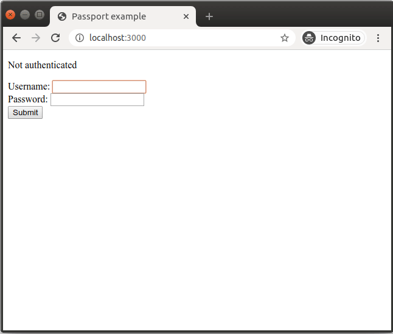

# Example with [`passport-jwt`](https://www.passportjs.org/packages/passport-jwt/)

This example shows how to retrieve the authentication context from a basic [Express](http://expressjs.com/) + [Passport](http://www.passportjs.org/) application.



Please read the related guide: https://socket.io/how-to/use-with-jwt

## How to use

```
$ npm ci && npm start
```

And point your browser to `http://localhost:3000`. Optionally, specify a port by supplying the `PORT` env variable.

## How it works

The client sends the JWT in the headers:

```js
const socket = io({
  extraHeaders: {
    authorization: `bearer token`
  }
});
```

And the Socket.IO server then parses the token and retrieves the user context:

```js
io.engine.use((req, res, next) => {
  const isHandshake = req._query.sid === undefined;
  if (isHandshake) {
    passport.authenticate("jwt", { session: false })(req, res, next);
  } else {
    next();
  }
});
```
